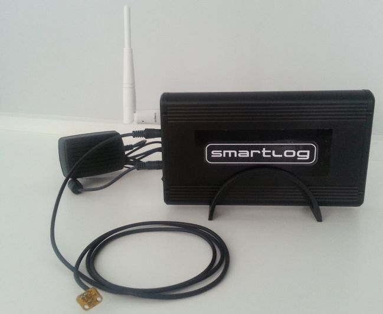
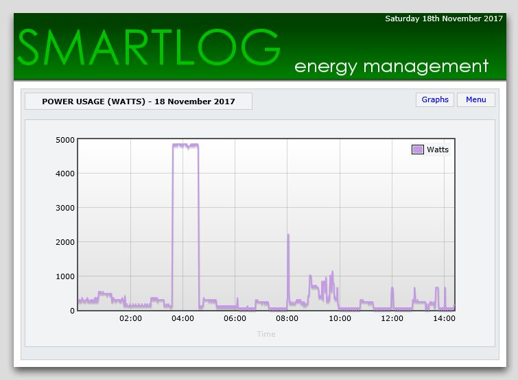
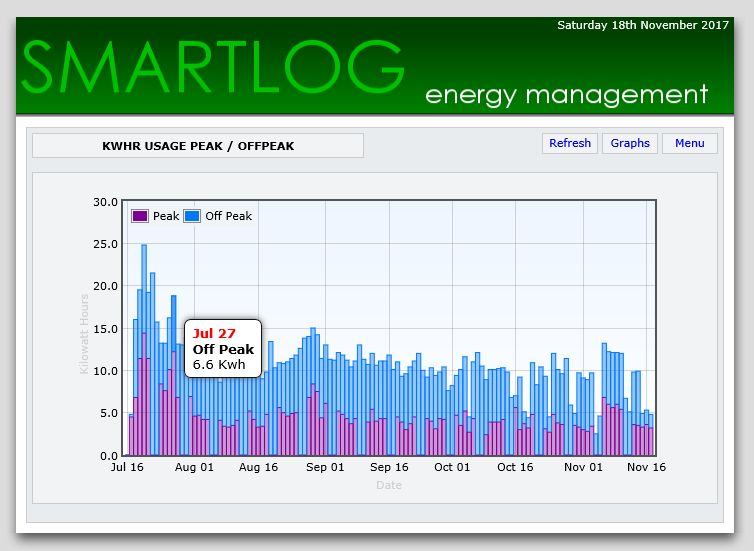

SmartLog
---

- **Description:** SmartLog is a Home Energy Management System built on Raspberry Pi and Arduino Hardware.

---

- **Hardware:** SmartLog uses the Arduino Pro Mini (3v) and Raspberry PI Zero.

---

 and Raspberry PI Zero")

- **Track Energy Usage:** SmartLog tracks energy usage from your average "smart meter" and graphs results.

---

---

